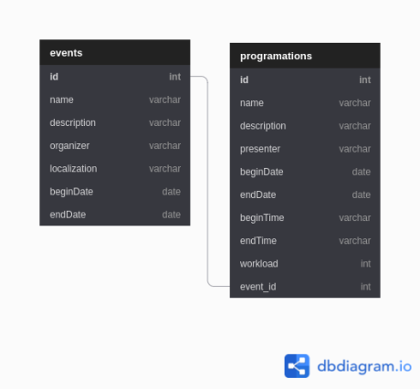

# Events
Events é um projeto proposto por [Igor Claudino](https://github.com/igorclaudino) com o intuito de desmostrar na prática o uso do Spring boot.

## Tecnologia usada

Foi utilizado o [Spring boot](https://start.spring.io/) para desenvolver este projeto.

## Diagrama 
O projeto é constituido da seguinte forma:

## Clonando o projeto
Para clonar o projeto e importa-lo no Eclipse (IDE), faça:
 * Clone o projeto em sua maquina;
 * No Eclipse, va em **File > Import > Maven > Existing Maven Projects **;
 * Clique em **Browse**, navegue até onde a pasta onde foi clonado o projeto e clique em **Abrir**;
 * Clique em **Finish** para finalizar a importação;
 
## Execultando o projeto
Para execultar o projeto procure pelo arquivo `EventsNpdsApplication.java`, que se encontra na pasta/pacote `br.ufc.crateus.events` e clique em `Run`.